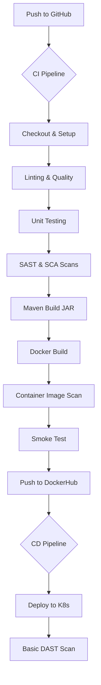

# SecureDelivery: Advanced DevOps CI/CD Project - Final Report

## 1. Problem Background & Motivation
Modern software development requires high velocity without compromising on security. Traditional CI/CD pipelines often focus solely on "making the build green," ignoring the security posture of the application and its dependencies. This "SecureDelivery" project was motivated by the need to implement a **DevSecOps** approach, where security is shifted left and integrated into every stage of the pipeline.

## 2. Application Overview
The application is a lightweight Spring Boot service built with Java 17. It exposes a simple REST API and serves as a blueprint for production-ready microservices. The application is containerized using a multi-stage Docker build to ensure a minimal attack surface and optimized performance.

## 3. CI/CD Architecture Diagram

## 4. CI/CD Pipeline Design & Stages
The pipeline is designed to be **fail-fast**. If any stage (linting, tests, or security scans) fails, the pipeline terminates immediately, preventing "bad" code from moving downstream.

- **Quality Guardrails:** Maven Checkstyle ensuring consistent coding standards.
- **Security Gates:** Trivy is used for both dependency scanning (SCA) and container image scanning.
- **Validation:** Smoke tests run the container in the CI environment to ensure it's functional before pushing.

## 5. Security & Quality Controls
- **Shift-Left Security:** SCA scans occur before the build to detect vulnerable libraries early.
- **Container Hardening:** Using `eclipse-temurin` JRE-only images for the runtime stage to reduce the footprint.
- **Secret Management:** No credentials are hardcoded; all sensitive data (DockerHub tokens) is managed via GitHub Secrets.

## 6. Results & Observations
The implemented pipeline successfully identifies:
- Coding standard violations.
- Logic errors through unit tests.
- Vulnerable third-party dependencies.
- Infrastructure vulnerabilities in the base Docker image.

By integrating smoke tests, we ensure that even if a build is "successful," any runtime failure (e.g., missing environment variables or broken entrypoints) is caught before deployment.

## 7. Limitations & Improvements
- **Real DAST:** Currently, the DAST scan in the CD pipeline is a placeholder. Integration with OWASP ZAP or similar tools would be the next step.
- **Kubernetes Integration:** The deployment is simulated. Integration with a live EKS/GKE cluster using Helm would enhance the project.
- **Infrastructure as Code (IaC):** Adding Terraform scripts to provision the K8s cluster would complete the DevOps lifecycle.
